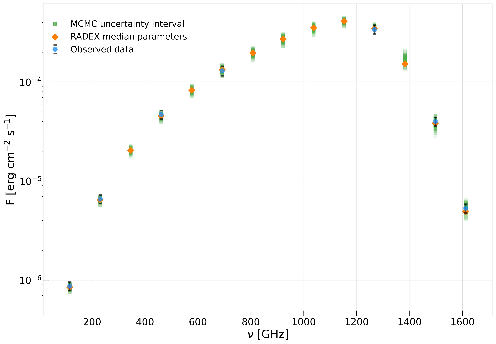
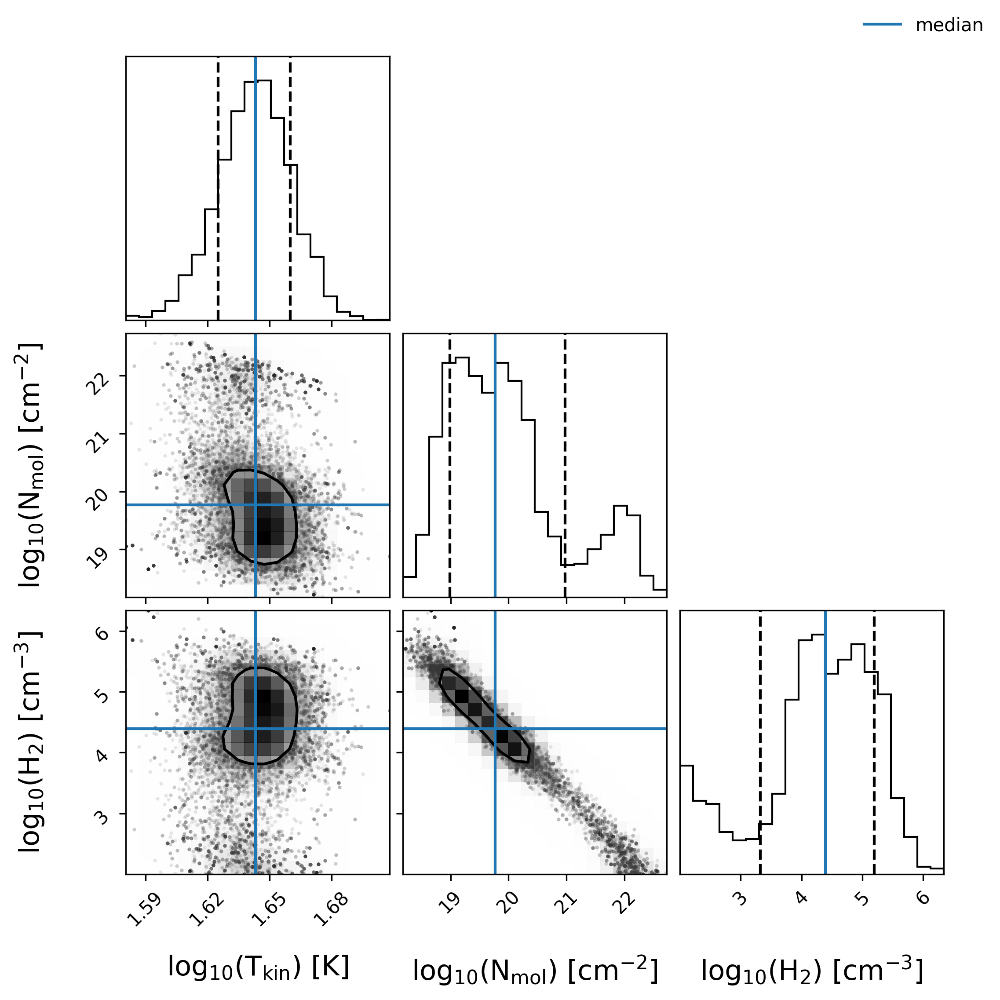

# ReverseRADEX

<div id="header" align="center">

  [](https://www.python.org) [](./LICENSE) 
</div>

---

<br />

> **Important**
> Beware, this program has not undergone rigorous testing. Testing has primairly been performed using only the [CO](https://home.strw.leidenuniv.nl/~moldata/CO.html) molecule.


ReverseRADEX is a tool to quickly gauge the physical conditions in a gas cloud from line spectra. [RADEX](https://personal.sron.nl/~vdtak/radex/index.shtml) is a 1D non-LTE radiative transfer code that assumes a homogeneous isothermal gas cloud. Where the medium is described using the [escape probability formalism](https://www.aanda.org/articles/aa/full/2007/23/aa6820-06/aa6820-06.right.html#SECTION00033000000000000000 "Escape probability implementation in RADEX") to first order.

<!-- What ReverseRADEX offers: -->
<!-- - -->
<!-- itemized key features?
- LAMDA file format
- Chain algorithm optimization
  - Fig 2?
- Parameter estimation + uncertainty budget (HPD?/HDI? and link to a wikipedia source or whatever on this to make clear what numbers are being reported!!!)
  - Parameter correlation
- ???
-->


<br />

Highlighted in Figure [1](#Figure1) is the benefit of ReverseRADEX over regular RADEX. It automates the optimization process of matching model spectra to observed line spectra.


<!-- AND what is being fit exactly (an SLED (various units)? see thesis again) -->


<div id="Figure1" align="center">

  ```mermaid
  %%{
    init:{
      "theme":"neutral",
      "themeVariables":{
        "labelBackgroundColor":"black",
        "clusterBkg":"#FFFFFF",
        "textColor":"grey"
      }
    }
  }%%
  %% https://books.google.nl/books?id=CBQ-EAAAQBAJ&pg=PA352&dq=labelBackgroundColor
  %%https://github.com/mermaid-js/mermaid/blob/develop/docs/theming.md

  graph LR
    subgraph Run once
      START1[Observed spectrum +<br />boundary conditions] ---> A[ReverseRADEX] ---> END1[Physical conditions]
    end

    subgraph Run many times
      START2[Physical conditions] ---> B[RADEX] ---> END2[Model spectrum]
    end


    %% https://stackoverflow.com/a/50270505
    style START1 fill:#FFFFFF, stroke:#FFFFFF
    style START2 fill:#FFFFFF, stroke:#FFFFFF
    style END1 fill:#FFFFFF, stroke:#FFFFFF
    style END2 fill:#FFFFFF, stroke:#FFFFFF
  ```

  **Figure 1:** Flow diagram showcasing the workflow of RADEX vs. ReverseRADEX.

</div>


<br />

To obtain optimal parameter estimates + uncertainties, ReverseRADEX employs an algorithm chain shown in Figure [2](#Figure2),


<div id="Figure2" align="center">

  ```mermaid
  %%{
    init:{
      "theme":"neutral",
      "themeVariables":{
        "labelBackgroundColor":"black",
        "textColor":"grey"
      }
    }
  }%%
  %% https://books.google.nl/books?id=CBQ-EAAAQBAJ&pg=PA352&dq=labelBackgroundColor
  %%https://github.com/mermaid-js/mermaid/blob/develop/docs/theming.md

  graph TD
    START[Line spectra + parameter bounds] .-> A2[Initial guess: <br /> brute force grid search]
    A2 -->|Initial parameter estimates| B2[Refine estimates: <br /> Levenberg-Marquardt <br /> Least Squares]
    B2 -->|Refined parameter estimates| C2[Uncertainty budget: <br /> MCMC]
    C2 .-> END[Parameter + uncertainty estimates]


    %% https://stackoverflow.com/a/50270505
    style START fill:#FFFFFF, stroke:#FFFFFF
    style END fill:#FFFFFF, stroke:#FFFFFF
  ```


  **Figure 2:** Flow diagram showcasing the optimizing algorithm chain used in ReverseRADEX.

</div>


<br />

RADEX was originally written in Fortran but implemented in ReverseRADEX via a python wrapper package, [GitHub/uclchem/SpectralRadex](https://github.com/uclchem/SpectralRadex). In addition to wrapping the source code, it was also modernized to introduce proper multiprocessing capabilities. \
The supported (file format for the) molecular data is maintained in the Leiden Atomic and Molecular Database, [LAMDA](https://home.strw.leidenuniv.nl/~moldata/).

> **Note**
> See the following BSc thesis, [fse.studenttheses.ub.rug.nl/ReverseRADEX](http://fse.studenttheses.ub.rug.nl/id/eprint/25088), for further details on and discussing of (the development of) ReverseRADEX.

<br />


<!-- omit in toc -->
## Table of Contents

<!-- use  `` inside [] to create grey box, and use " " inside () to rename text shown on hover -->

- [Getting started](#getting-started)
  - [Dependencies](#dependencies)
  - [Installation](#installation)
- [Usage](#usage)
- [output](#output)
- [License(s)](#licenses)
- [Acknowledgments](#acknowledgments)

<br />

<details closed>
  <summary>
    Code folder structure
  </summary>
  <br />

  <!-- FIXME: make it look nicer (in a code block it looks much nicer but you loose hyperlinks?, ...) ALSO add a descriptions see e.g. https://github.com/yangcht/radex_emcee#directory-structure
  -->
  [:package: ReverseRadex/](https://gitlab.astro.rug.nl/mooren/reverseradex) <br />
  &nbsp; ├── [:open_file_folder: fitting/](./fitting)  <br />
  &nbsp; │ &emsp;&nbsp;&nbsp; ├── [find_initial_guess.py](./fitting/find_initial_guess.py) <br />
  &nbsp; │ &emsp;&nbsp;&nbsp; ├── [fitting_helper_functions.py](./fitting/fitting_helper_functions.py) <br />
  &nbsp; │ &emsp;&nbsp;&nbsp; ├── [LM.py](./fitting/LM.py) <br />
  &nbsp; │ &emsp;&nbsp;&nbsp; ├── [MCMC.py](./fitting/MCMC.py) <br />
  &nbsp; │ &emsp;&nbsp;&nbsp; └── [\_\_init__.py](./fitting/\__init__.py) <br />
  &nbsp; ├── [:open_file_folder: save_plot/](./save_plot)  <br />
  &nbsp; │ &emsp;&nbsp;&nbsp; ├── [plot.py](./save_plot/plot.py) <br />
  &nbsp; │ &emsp;&nbsp;&nbsp; ├── [save.py](./save_plot/save.py) <br />
  &nbsp; │ &emsp;&nbsp;&nbsp; ├── [save_plot_helper.py](./save_plot/save_plot_helper.py) <br />
  &nbsp; │ &emsp;&nbsp;&nbsp; └── [\_\_init__.py](./save_plot/\__init__.py) <br />
  &nbsp; ├── [:open_file_folder: user_input/](./user_input)  <br />
  &nbsp; │ &emsp;&nbsp;&nbsp; ├── [constant_input.py](./user_input/constant_input.py) <br />
  &nbsp; │ &emsp;&nbsp;&nbsp; ├── [input_functions.py](./user_input/input_functions.py) <br />
  &nbsp; │ &emsp;&nbsp;&nbsp; ├── [read_user_data.py](./user_input/read_user_data.py) <br />
  &nbsp; │ &emsp;&nbsp;&nbsp; ├── [variable_input.py](./user_input/variable_input.py) <br />
  &nbsp; │ &emsp;&nbsp;&nbsp; └── [\_\_init__.py](./user_input/\__init__.py) <br />
  &nbsp; └── [main.py](./main.py) <br />


</details>

<br />


## Getting started
<!-- linking to dependencies listed at the bottom feels wrong? maybe move up? -->

### Dependencies

ReverseRADEX has been developed (and tested) using python 3.6 but I expect it to work on later versions as well. The specific python modules required to run ReverseRADEX are listed in Table [1](#dependencies). But again, ReverseRADEX presumably works using different versions of the modules as well.

<br />

<div id="dependencies" align="center">

  | module          | version |
  | :-------------- | :-----: |
  | [corner]        |  2.2.1  |
  | [emcee]         |  3.1.2  |
  | [matplotlib]    |  3.3.4  |
  | [numpy]         | 1.19.5  |
  | [pandas]        |  1.1.5  |
  | [scipy]         |  1.5.4  |
  | [spectralradex] |  1.1.3  |

  [corner]: https://www.pypi.org/project/corner/2.2.1
  [emcee]: https://www.pypi.org/project/emcee/3.1.2
  [matplotlib]: https://www.pypi.org/project/matplotlib/3.3.4
  [numpy]: https://www.pypi.org/project/numpy/1.19.5
  [pandas]: https://www.pypi.org/project/pandas/1.1.5
  [scipy]: https://www.pypi.org/project/scipy/1.5.4
  [spectralradex]: https://www.pypi.org/project/spectralradex/1.1.3

  **Table 1:** The main dependencies of ReverseRADEX, listed in [requirements.txt](./requirements.txt "requirements.txt").
</div>

The only tested operating system is (Ubuntu) Linux but ReverseRADEX should be able to run on other platforms (like MacOS, Windows) as well.

> **Note**
> I tried running SpectralRadex on Windows in the past but to no avail. The author(s) of Spectralradex do claim [OS independence](https://github.com/uclchem/SpectralRadex/blob/20768fdf577bd38b40f98cee0eb97400c48443a2/setup.py#L41) however.


### Installation

To *install* ReverseRADEX, it is **recommended** to create a virtual python environment (e.g. using [venv](https://docs.python.org/3/library/venv.html)) and pip install the [requirements.txt](./requirements.txt "requirements.txt") file,

```shell
pip install requirements.txt
```


<br />
<div align="right">

  [](#table-of-contents)
</div>

---


## Usage

<!-- with subsection(s) on how to run specific "configuration" if I can think
of some?
ALSO sub-sections for input and output? or have output be an entirely different section. +++ output folder is created, mention what name and where!-->

You can either provide a config file

```shell
python main.py -config config.ini
```

where config.ini is,

```ini
# Configure the ReverseRADEX settings
[PATHS]
reverseradex_dir = /home/user/
# path to LAMDA compliant format molecular data file
MolecularFile = '%(reverseradex_dir)s/co.dat'
# path to (observed) spectral data file
SpectraFile = '%(reverseradex_dir)s/data.dat'

[CONSTANT_PARAMETERS]
# background radiation field temperature [K]
BackgroundTemperature = 2.73
# line width [km/s]
LineWidth = 1.0
# (1=uniform sphere, 2=LVG, 3=slab)
Geometry = [1, 'uniform sphere']

# [name parameter, initial guess, (bound_low, bound_upp), fit parameter?]
[VARIABLE_PARAMETERS]
# kinetic temperature: 0.1 < tkin < 1e4 [K]
Tkin = ['tkin', 100.0, (5.0, 750.0), True]
# column density: 1e5 < cdmol 1e25 [cm^-2]
Coldens = ['cdmol', 1e19, (1e13, 1e24), True]
# volume densities: 1e-3 < coll partner < 1e13 [cm^-3]
# NOTE: the indentation is needed to correctly interpret 'Voldens' as a dict.
Voldens = {'h2':(1e4, True),
           'h':(0.0, False),
           'e-':(0.0, False),
           'p-h2':(0, False),
           'o-h2':(0.0, False),
           'h+':(0.0, False),
           'he':(0.0, False),
           'min_max':(1e2, 1e8)}
```


where `MolecularFile` is from [LAMDA](https://home.strw.leidenuniv.nl/~moldata/) and `SpectraFile` are your observed line intensities that need to be provided as follows,


```dat
#3
115.271  8.7e-07  8.7e-08
230.538  6.6e-06  6.6e-07
461.041  4.7e-05  4.7e-06
691.473  1.3e-04  1.4e-05
1267.014  3.4e-04  3.5e-05
1496.922  4.0e-05  4.0e-06
1611.793  5.3e-06  5.3e-07
```

> **Note**
> This data is NOT based om observations. It has been computed from RADEX models with some Gaussian noise added on top of it.

where the first column represents the line frequencies \[GHz\], the second collumn gives the corresponding intensity and a final (optional) column with the standard deviations. The first line must be the units of the provided data,


- #1: T$_R$ \[K\]
- #2: flux \[K km s$^{-1}$\]
- #3: flux \[erg cm$^{-2}$ s$^{-1}$ \].


You can also run it without the config, if you want to enter each argument individually by hand,

```shell
python main.py
```

<!-- highlight that molfile needs to be full path AND shorter than 80 character? (fortran limitation and just how i coded it?, see how spectralradex did it? that works fine right?) -->

<!-- example? main.py and main.ipynb way with gifs/figures? -->
<!-- figure out how to link to files in the reverseradex folder? -->


<br />
<div align="right">

  [](#table-of-contents)
</div>

---

## Output

> This output is based on the the example inputs `config.ini` and `SpectraFile` provided above.
 
An overview of the input + parameter estimates (simply the median and 16th and 84th quartiles) are provided.

```bash
Data file used: <path to data.dat>
Line (frequencies [Hz]) used: 115.2712018, 230.538, 461.0407682, 691.4730763, 1267.014486, 1496.922909, 1611.793518
tbg = 2.73
fmin = 0
fmax = 30000000
linewidth = 1.0
geometry = 1
molfile = <path to moldata.dat>
h = 0.0
e- = 0.0
p-h2 = 0
o-h2 = 0.0
h+ = 0.0
he = 0.0
tkin's parameter boundaries: (0.6989700043360189, 2.8750612633917)
cdmol's parameter boundaries: (13.0, 24.0)
h2's parameter boundaries: (2.0, 8.0)

Percental:    50%    |    16%    |    84%    |
log10(tkin): 1.64313 | -0.01791 | +0.01687
log10(cdmol): 19.77129 | -0.78429 | +1.20455
log10(h2): 4.39320 | -1.07087 | +0.80508
```

As well as plot of the line spectrum with some MCMC iterations shown as green boxes to represent the *uncertainty* in the reproduction of the observations,



And a corner plot of the parameter space,




<br />
<div align="right">

  [](#table-of-contents)
</div>

---


<!-- ## Work in Progress/Roadmap? (if I decide to work some more on the project and what the future goals are?)
!!! todo
    - make plotting (matpltolib, corner) optional dependencies.
    - ???
<br />

<br />
<div align="right">

  [](#table-of-contents)
</div>

---
-->


<!-- ## Related/Alternative/Similar Software
like https://github.com/yangcht/radex_emcee ?, https://github.com/jrka/pyradexnest ?, https://github.com/richteague/radexcee ?, https://github.com/Marcus-Keil/UCLCHEMCMC ?, https://github.com/avantyghem/pyradex_mcmc ?, ...
Also a brief description on how it is different?

<br />

<br />
<div align="right">

  [](#table-of-contents)
</div>

---
-->

## License(s)

<div align="center">

  | License *file* | License type |
  | :---: | :---: |
  | [RADEX](./LICENSE-RADEX) | Source code comment regarding referencing |
  | [ReverseRADEX](./LICENSE) | MIT |

</div>

<br />
<div align="right">

  [](#table-of-contents)
</div>

---


## Acknowledgments

This program was developed under the supervision of Prof. Dr. Floris F.S. van der Tak, leading to the following BSc thesis [fse.studenttheses.ub.rug.nl/ReverseRADEX](http://fse.studenttheses.ub.rug.nl/id/eprint/25088), with relevant references listed therin.

<br />

<div align="center">

  Further Acknowledgments:

  | source | description |
  | :-----: | :--------: |
  | [shields.io](https://shields.io/) | (embedding links in) icons |
  | [choosealicense.com](https://choosealicense.com/) | license template |
  | [github.com/gitlab-emoji](https://github.com/yodamad/gitlab-emoji) | emoji list for GitLab|
  | [mermaid.github.io](https://mermaid-js.github.io/) | generating diagrams|

</div>

<br />
<div align="right">

  [](#table-of-contents)
</div>
